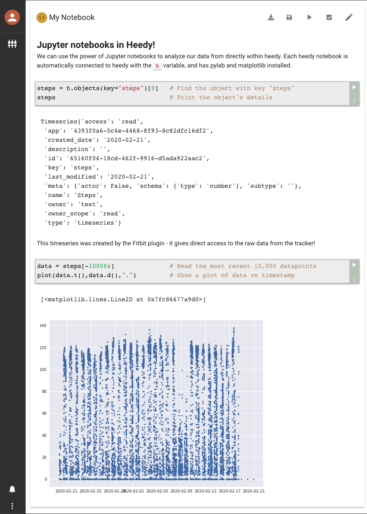

# Heedy Notebook Plugin

This plugin enables use of Jupyter-like notebooks from directly within Heedy. The notebooks are automatically connected to heedy, giving you direct access to all your data. Right now, it is assumed that all users of Heedy are trusted, since the notebooks are not isolated - any user can create a notebook and run arbitrary code!

To install it, upload the release zip folder to heedy, and enable the resulting plugin. This will allow you to create notebook objects.

